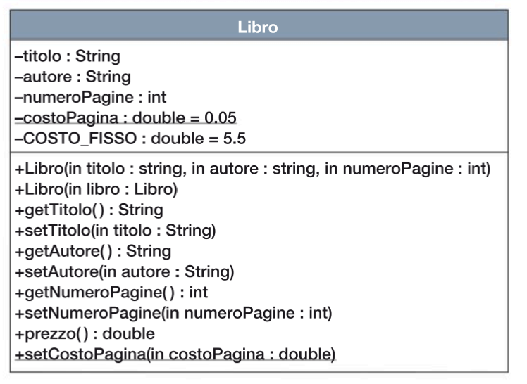
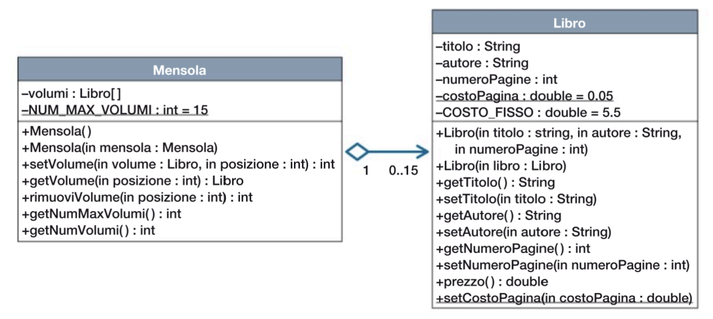
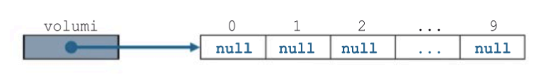
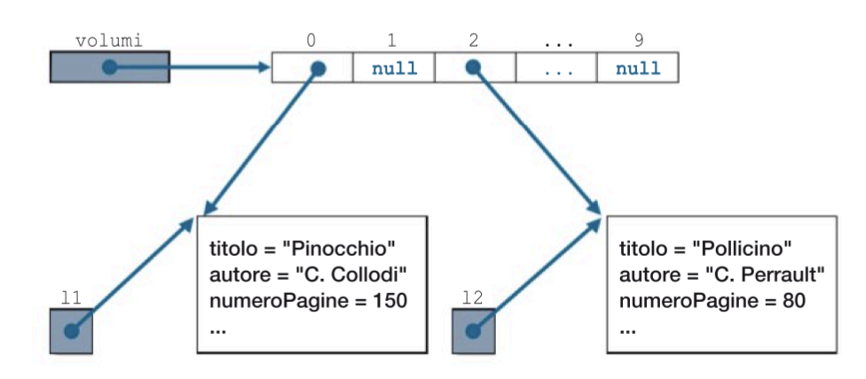
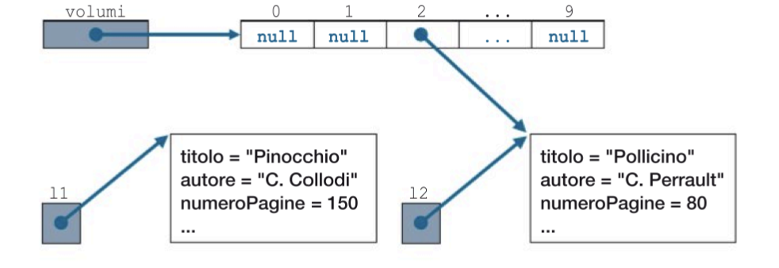
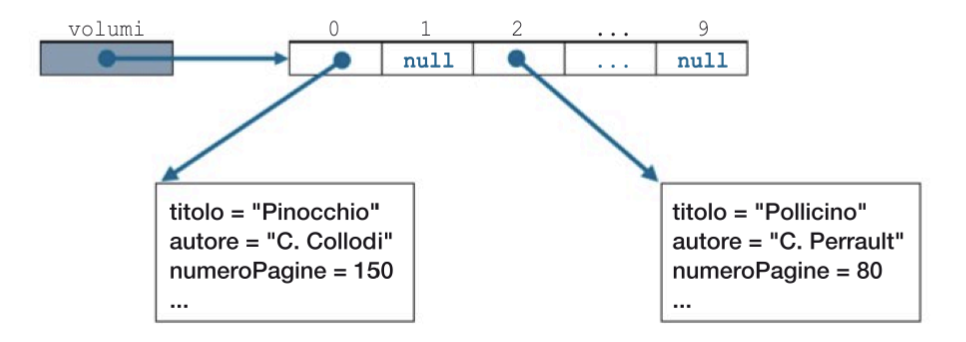
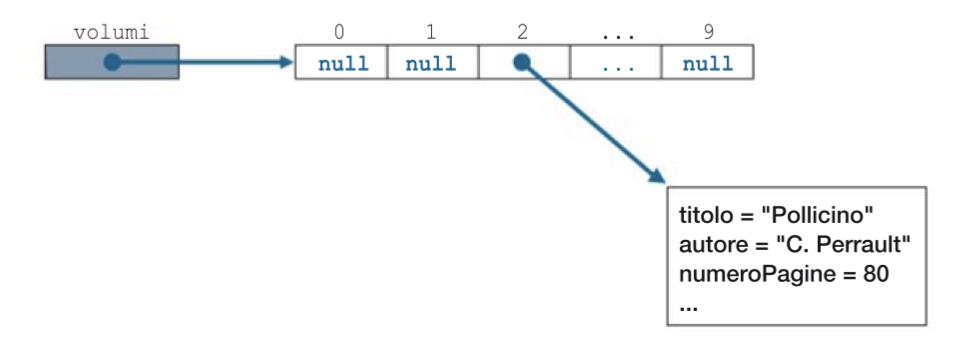

# Gestione di una Libreria con Java

Questa applicazione Java implementa un sistema di gestione di una libreria, con le seguenti funzionalità principali:

1. **Classe Libro**: Rappresenta un singolo libro con le seguenti proprietà:
    - Titolo
    - Autore
    - Numero di pagine
    - Costo per pagina (statico)
    - Costo fisso aggiuntivo

   La classe Libro fornisce metodi per:
    - Accedere e modificare le proprietà del libro
    - Calcolare il prezzo totale del libro in base al numero di pagine e ai costi fissi e variabili

2. **Classe Mensola**: Rappresenta una mensola che può contenere un numero massimo di 15 libri. La classe Mensola fornisce metodi per:
    - Inserire un libro in una determinata posizione sulla mensola
    - Ottenere una copia di un libro in una determinata posizione
    - Rimuovere un libro da una determinata posizione
    - Ottenere il numero massimo di volumi sulla mensola
    - Ottenere il numero di volumi attualmente presenti sulla mensola

## Diagramma delle Classi

Diagramma UML che rappresenta la classe Libro:



Diagramma UML che rappresenta le classi Libro e Mensola:


Come si può vedere, la classe Libro contiene le proprietà del libro e i relativi metodi getter, setter e di calcolo del prezzo. La classe Mensola contiene un array di oggetti Libro e i metodi per gestire l'inserimento, la rimozione e l'ottenimento dei libri sulla mensola.

Tabella che spiega la simbologia UML utilizzata, inclusi i dettagli sulla rappresentazione degli attributi e dei metodi statici o di istanza:

| Simbolo | Significato |
| --- | --- |
| Classe | Rettangolo con 3 sezioni: nome, attributi, metodi |
| Attributo | - Attributi di istanza (non statici) <br> _Attributi statici_ |
| Metodo | + Metodi di istanza (non statici) <br> _Metodi statici_ |
| Associazione | Linea semplice tra classi |
| Composizione | Linea con rombo vuoto alla fine |
| Aggregazione | Linea con rombo pieno alla fine |
| Ereditarietà | Linea con freccia vuota alla fine |
| Cardinalità | Indicatori numerici alle estremità delle relazioni |

<!-- [](https://mermaid.live/edit#pako:eNqVVN9r2zAQ_leE8mKzuKSDvOhhUDoGhboZpC1j0wiKJTuishQkuWsa8r9P1o_a7grt_GBL9913uvtOviOsFGUQwaIosLTcCobAV04aTdqWAMqEYKASxBiOpffxm-iBJXBPyaRRggAMzzFURfEFw8XZ2fkSw2u-1QrL3s3Yg4vkDaDmQqDZtqrnxmr1wNCsrtO6-MOp3aHP-6dkoMTsiNbkgMASLIdY6dgPRquUUBrNFovFe4EFlw_mP8OOsNdhvWCx8mNQrFhbzWUDnN6OPrWRzirNoo1LC2TXMq2-k4bLZDaWWF4Bqrpt3x5lbMBJxGu3FAm-XK1vV5tvV-v1KsCffC6Zf-cTU0hhDtLXHZ8cGmZvfbZZHuEImBcgmHPwqDgdWBe-njdYEXibdTMq2nFdIgNxgvUpjrl7zZ6f-yRD9QPrclApC1gOoo4DHctTali6Xsep5kHavi_lxY_NzV25uV9d35VX0cvr-Ou3Cym6lsfTY6gsf7WP33xI8r6nsdCaIP-o9OYF90D8uTykedupRz6GJzwnWUmePMyzf7EpcIJz6BRuCaduMPj6MbQ71jIMkVtSVpNOWAyDa39h1wdZQWR1x-ZQq67ZpU23p8SyOC4gqokwzron8qdSbXJi1F0gXYZB5OfR6S_b84uJ)
-->
[](https://mermaid.live/edit#pako:eNqVVG1r2zAQ_itC-2KzOLgrgeFvJWMQqJtB2jI6jaDasi0mS0GWs6Yl_31nSbbjrKPdB9une-65N53vBWcqZzjBURQRabgRLEGZoE2DvnBaaloTSVtTKZ2glSznaMn3XDBjOJGWYm0HU4S6x_Gv-aNW6KVTIBRtjOayRBBBCTXVgX-lmddxaZBsa6bVN1py2asbQw3PUK7aR8FQphrjcOrxAkTRw8v15na9_brabNYO_mhzCew7nKhcCjPUfyF8b1Ayc2uzDUIPe6AZAKcO0V7xfGRd2XpeYXngddbNSdHAhURG4gTrUjzl7jR7fu6SdNWPrOXYpcBhIfJ97OlHIscLS5lslKDDlXlb19ruXtKr79ubu3R7v76-S1feyvbxx09wKdqa--jeVRCenf03HJO872jMXY1r_0np5YBbwBp5SPO6VXt-Ck940LKUPlmYB39j58Cxe_UNIPiCYKSiCKR4Pr9YwGmI3ZgDjJgb7oILkXwo8njWGK1-MZCLwsvRb56bKrncPfWKnDYV1ZoeErRAi9FXH_Yd3j6BtwwmT0-wtxwbNc13YIJ8Gf8zQhx_Pi8YPJ1l-z--8AzDHNeU57Bw7JQRbCpWM4ITEEHQVOQEE3kE024tbA4yw4nRLZthrdqy6g_tLqeG-b2Dk4KKBrQ7Kh-UqnsjlsNvqlO34OyeO_4BO8OoAQ)

Questa rappresentazione del diagramma delle classi rispecchia fedelmente la struttura e le relazioni tra le classi Libro e Mensola, utilizzando la simbologia UML spiegata nella tabella precedente.


# Java Object Array Manipulation

- un oggetto di tipo `Mensola` incapsula un array di oggetti Java: ogni singola posizione dell’array `volumi` può contenere un oggetto di tipo `Libro`, o essere vuota (`null`);
- esistono due costruttori: il primo istanzia un oggetto di classe `Mensola` privo di libri, mentre il secondo istanzia un oggetto di classe `Mensola` contenente gli stessi libri di un oggetto della stessa classe `Mensola` preesistente e fornito come parametro (costruttore di copia);
- il metodo `setVolume` inserisce un volume in una posizione della mensola specificata mediante un indice se questa è valida (indice compreso tra 0 e il numero massimo di volumi previsto per la mensola) e vuota (`null`); se la posizione espressa dall’indice non è valida il metodo restituisce il valore negativo `-1`, se la posizione espressa dall’indice è valida ma non è vuota restituisce il valore negativo `-2`, se l’operazione è eseguita con successo restituisce l’indice della posizione (un valore positivo o uguale a 0);
- il metodo `getVolume` restituisce un oggetto di tipo `Libro` da una determinata posizione della mensola specificata mediante un indice se questa è valida (indice compreso tra 0 e il numero massimo di volumi previsto per la mensola), in caso contrario – o se la posizione è vuota (`null`) – il metodo restituisce il valore `null`;
- il metodo `rimuoviVolume` libera una determinata posizione della mensola specificata mediante un indice se questa è valida (secondo gli stessi criteri dei metodi `setVolume` e `getVolume`) e non vuota (`null`); se la posizione non è valida il metodo restituisce il valore negativo `-1`, se la posizione è valida ma vuota restituisce il valore negativo `-2`, se l’operazione è eseguita con successo (viene posto a `null` il valore contenuto nella posizione indicata) restituisce l’indice della posizione resa disponibile;
- i metodi `getNumMaxVolumi` e `getNumVolumi` restituiscono rispettivamente il numero massimo di volumi che la mensola può contenere (nel codice si fa sempre riferimento al valore dell’attributo costante `MAX_NUM_VOL` in modo che volendo adattare la classe a rappresentare mensole di dimensione diversa è sufficiente modificare solo l’inizializzazione di questo attributo) e il numero di volumi effettivamente presenti su una mensola nel momento dell’invocazione.

Nell’area di memoria *heap* dopo l’esecuzione dell’istruzione del costruttore della classe `Mensola` dell’esempio precedente:

```java

Libro volumi = new Libro[10];

```

si avrà una situazione come quella illustrata:



Supponendo di eseguire le seguenti istruzioni:

```java

   Libro 11 = new Libro("Pinocchio", "C. Collodi", 150);
   Libro 12 = new Libro("Pollicino", "C. Perrault", 80);
   volumi[0] = 11;
   volumi[2] = 12;

```
La situazione diviene la seguente:


Nella memoria heap, dopo l'esecuzione dell'istruzione del costruttore della classe Mensola dell'esempio precedente, si avrà una situazione come quella illustrata.


Se successivamente viene eseguita la seguente istruzione:

```java
volumi[0] = null;
```



Se invece l'inizializzazione dei vettori fosse stata effettuata mediante le seguenti istruzioni:
```java

volumi[0] = new Libro("Pinocchio", "C. Collodi", 150);
volumi[2] = new Libro("Pollicino", "C. Perrault", 80);

```

la situazione nello heap sarebbe stata la seguente



Dove l'oggetto della classe `Libro` a cui veniva fatto riferimento dall'elemento  di indice 0, non essendo più riferito da nessuna variabile, è stato rimossa dal `Garbage Collector` della `JVM`.

<!--
## Collegamenti alle immagini

1. [Immagine 1](img/3volumi.png)
2. [Immagine 2](img/5volumi.png)
3. [Immagine 3](img/7volumi.png)
4. [Immagine 4](img/9volumi.png)
5. [Immagine 5](img/91volumi.png)
-->
# Costruttore di copia
Le variabili di tipo non primitivo del linguaggio Java contengono, anziché un valore, un riferimento a un oggetto allocato nell'area di memoria heap.
Un `costruttore di copia` è un metodo costruttore che <u>consente di inizializzare un nuovo oggetto come copia di un oggetto creato in precedenza e fornito come parametro</u>.
In pratica, un costruttore di copia è un filtro che assegna, al momento della creazione del nuovo oggetto, il valore di tutti gli attributi dell'oggetto passato come parametro.

In questo modo, il nuovo oggetto sarà indipendente dall'originale, poiché la copia avviene al livello degli attributi.

```java
   public Libro(Libro libro) {
      this.titolo = libro.getTitolo();
      this.autore = libro.getAutore();
      this.numeroPagine = libro.getNumeroPagine();
   }
```

>## Nota: `String`
>
>- 1. Il fatto che gli oggetti di classe `String` siano **<u>immutabili</u>** li rende, da questo punto di vista, **<u>utilizzabili come variabili di un `tipo primitivo`</u>**.
>- 2. Quando gli attributi di una classe non sono di un tipo primitivo ma sono riferimenti a oggetti istanziati da una classe, il comportamento nella clonazione richiede attenzione. 
>> Bisogna considerare che:
  >>  - Se gli oggetti sono immutabili (come `String`), non ci sono problemi, poiché non possono essere modificati.
  >>  - Se invece gli oggetti sono mutabili, potrebbe essere necessario implementare una **clonazione profonda** per evitare che le modifiche agli attributi dell'oggetto originale influenzino la copia.
>
> 
 
## Utilizzo degli Array di Classi

Nell'applicazione, gli array vengono utilizzati per rappresentare la collezione di libri presenti sulla mensola. 

Nello specifico:

- Nella classe Mensola, l'array `volumi` di tipo `Libro[]` viene utilizzato per memorizzare i libri presenti sulla mensola. Questo array ha una dimensione fissa pari a 15, che rappresenta il numero massimo di libri che possono essere contenuti sulla mensola.
- Quando si inserisce un nuovo libro sulla mensola, viene creata una copia dell'oggetto Libro passato come parametro e questa copia viene inserita in una posizione libera dell'array `volumi`.
- Quando si richiede un libro dalla mensola, viene restituita una nuova copia dell'oggetto Libro memorizzato nell'array, in modo da evitare che modifiche all'oggetto restituito possano influenzare gli altri libri sulla mensola.
- Quando si rimuove un libro dalla mensola, l'elemento corrispondente nell'array `volumi` viene impostato a `null`, liberando la posizione per un nuovo libro.

Questa implementazione basata sugli array permette di avere una struttura dati semplice e efficiente per la gestione della collezione di libri sulla mensola, mantenendo l'incapsulamento e l'integrità dei singoli oggetti Libro.

## Conclusioni

Questa applicazione Java dimostra l'utilizzo di classi per rappresentare entità del mondo reale (Libro e Mensola) e l'uso di array per memorizzare e gestire le istanze di queste classi. I principi di programmazione a oggetti, come incapsulamento, ereditarietà e polimorfismo, sono applicati in modo da rendere il codice modulare, estendibile e facile da manutenere.

Inoltre, l'applicazione include diverse funzionalità di base per la gestione di una libreria, come l'inserimento, la rimozione e l'ottenimento di libri, nonché il calcolo del prezzo di un libro in base alle sue proprietà.