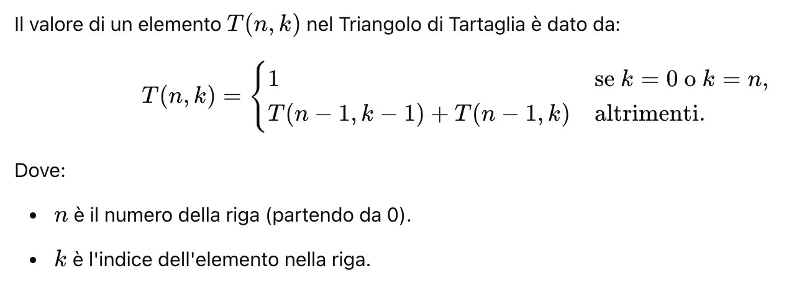

# Ricorsione: Analisi Approfondita e Applicazioni

## Fondamenti della Ricorsione

### Definizione
La ricorsione è un metodo di risoluzione dei problemi in cui una funzione si richiama autonomamente, suddividendo un problema complesso in istanze più semplici.

### Componenti Essenziali
1. **Caso Base**: Condizione di interruzione
2. **Passo Ricorsivo**: Riduzione del problema
3. **Convergenza**: Avvicinamento al caso base

## Esempi Matematici Ricorsivi

### 1. Moltiplicazione Ricorsiva
```java
public int moltiplicaRicorsivo(int a, int b) {
    // Caso base
    if (b == 0) return 0;
    // Passo ricorsivo
    return a + moltiplicaRicorsivo(a, b - 1);
}
```
**Logica**: Somma ripetuta `a` per `b` volte

### 2. Potenza Ricorsiva
```java
public double potenzaRicorsiva(double base, int esponente) {
    // Casi base
    if (esponente == 0) return 1;
    if (esponente == 1) return base;
    
    // Passo ricorsivo
    return base * potenzaRicorsiva(base, esponente - 1);
}
```
**Variante Ottimizzata**:
```java
public double potenzaVeloce(double base, int esponente) {
    if (esponente == 0) return 1;
    if (esponente % 2 == 0) {
        double meta = potenzaVeloce(base, esponente/2);
        return meta * meta;
    }
    return base * potenzaVeloce(base, esponente - 1);
}
```

### 3. Triangolo di Tartaglia (Coefficienti Binomiali)



```java
public int coefficienteBinomiale(int n, int k) {
    // Casi base
    if (k == 0 || k == n) return 1;
    
    // Passo ricorsivo
    return coefficienteBinomiale(n-1, k-1) + coefficienteBinomiale(n-1, k);
}
```

## Successioni Celebri

### Fibonacci: Origine e Implementazione
**Storia**: Ideata da Leonardo Fibonacci nel 1202, originariamente per modellare la crescita delle popolazioni di conigli.

```java
public int fibonacci(int n) {
    // Casi base
    if (n <= 1) return n;
    
    // Passo ricorsivo
    return fibonacci(n-1) + fibonacci(n-2);
}
```

### Numeri Primi: Verifica Ricorsiva
```java
public boolean isPrimo(int n, int divisore) {
    // Casi base
    if (n <= 1) return false;
    if (divisore == 1) return true;
    
    // Controllo divisibilità
    if (n % divisore == 0) return false;
    
    // Passo ricorsivo
    return isPrimo(n, divisore - 1);
}
```

## Applicazioni Avanzate

### 1. Esplorazione Strutture Dati
#### Attraversamento Alberi Binari
```java
public void visitaAlbero(NodoAlbero nodo) {
    if (nodo == null) return;
    
    // Pre-ordine: radice, sinistra, destra
    System.out.println(nodo.valore);
    visitaAlbero(nodo.sinistra);
    visitaAlbero(nodo.destra);
}
```

### 2. Algoritmi di Rete e Percorso

#### Dijkstra: Percorso Minimo
```java
class Dijkstra {
    public int[] calcolaPercorsiMinimi(Grafo grafo, int sorgente) {
        int[] distanze = new int[grafo.dimensione()];
        boolean[] visitati = new boolean[grafo.dimensione()];
        
        // Inizializzazione
        Arrays.fill(distanze, Integer.MAX_VALUE);
        distanze[sorgente] = 0;
        
        for (int i = 0; i < grafo.dimensione() - 1; i++) {
            int u = trovaVerticeMinimo(distanze, visitati);
            visitati[u] = true;
            
            for (int v = 0; v < grafo.dimensione(); v++) {
                if (!visitati[v] && grafo.esisteArco(u, v)) {
                    aggiornaDistanza(distanze, u, v, grafo);
                }
            }
        }
        
        return distanze;
    }
}
```

## Ottimizzazioni e Limitazioni

### Tecniche di Miglioramento
- Memoization
- Programmazione Dinamica
- Tail Recursion

### Potenziali Rischi
- Overflow dello stack
- Performance degradate
- Complessità computazionale elevata

## Conclusioni

La ricorsione rappresenta un paradigma potente per risolvere problemi complessi, richiedendo una profonda comprensione dei principi algoritmici e una progettazione accurata.