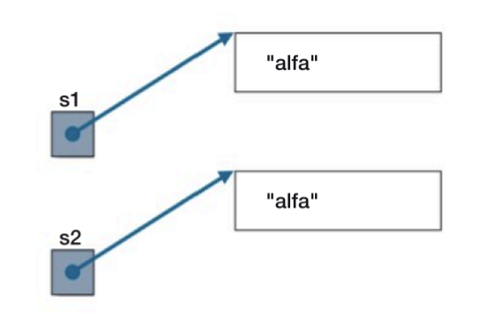

### **Tabella 8: Segnaposto per formattazione in Java**
| **Segnaposto** | **Specificazione**                                                                 |
|-----------------|-----------------------------------------------------------------------------------|
| **%b, %B**      | Valore booleano (es. `true` o `false`).                                          |
| **%s, %S**      | Stringa ottenuta invocando il metodo `toString` dell'oggetto.                   |
| **%c, %C**      | Caratteri (es. 'a', 'Z').                                                       |
| **%d**          | Valori interi in formato decimale.                                              |
| **%x, %X**      | Valori interi in formato esadecimale (rispettivamente minuscolo e maiuscolo).    |
| **%f**          | Valori floating-point (numeri decimali).                                        |
| **%e, %E**      | Valori floating-point in formato esponenziale (es. `1.23e+10` o `1.23E+10`).    |

---

### **Confronto di stringhe e oggetti in Java**
In Java, l'uguaglianza di due stringhe o di due oggetti non può essere verificata direttamente con l'operatore di confronto `==`, perché questo operatore confronta i riferimenti in memoria, non i contenuti. Per confrontare il contenuto, bisogna utilizzare il metodo `equals`.

#### **Esempi di confronto**
Prendiamo in esame due frammenti di codice:

**Primo caso: uso esplicito di `new`**
```java
String s1 = new String("alfa");
String s2 = new String("alfa");
System.out.println(s1 == s2); // Output: false
```
Nel primo caso:
- L'uso di `new String("alfa")` crea due oggetti distinti nella memoria heap.
- Anche se le stringhe contengono lo stesso valore (`"alfa"`), i riferimenti `s1` e `s2` puntano a due oggetti diversi, per cui il confronto con `==` restituisce `false`.



**Secondo caso: costanti stringa**
```java
String s1 = "beta";
String s2 = "beta";
System.out.println(s1 == s2); // Output: true
```
Nel secondo caso:
- La stringa `"beta"` è una costante stringa e il compilatore Java ottimizza il codice utilizzando **un unico oggetto nella memoria heap condivisa (String Pool)**.
- Quindi, `s1` e `s2` fanno riferimento allo stesso oggetto, per cui il confronto con `==` restituisce `true`.


---

### **Perché i risultati sono diversi?**
1. **Uso di `new`**: Nel primo caso, ogni chiamata a `new` crea un nuovo oggetto stringa nello heap, quindi i riferimenti sono diversi.
2. **Ottimizzazione del compilatore**: Nel secondo caso, il compilatore riconosce che entrambe le stringhe sono identiche e ottimizza utilizzando un singolo riferimento nello String Pool.

---

### **Approccio corretto: il metodo `equals`**
Per confrontare il contenuto di due stringhe (o oggetti in generale), è necessario utilizzare il metodo `equals`. Ad esempio:

```java
String s1 = new String("gamma");
String s2 = new String("gamma");

System.out.println(s1.equals(s2)); // Output: true
```
In questo caso, `equals` verifica che i contenuti delle due stringhe siano identici, a prescindere dai riferimenti in memoria.

---

### **Ricapitolazione**
- **`==`** confronta i riferimenti, cioè verifica se due variabili puntano allo stesso oggetto.
- **`equals`** confronta il contenuto degli oggetti.
- Java effettua ottimizzazioni sullo String Pool per evitare duplicazioni di stringhe costanti.

Questa distinzione è fondamentale per evitare bug nei programmi che utilizzano stringhe o altri tipi di oggetti! 😊